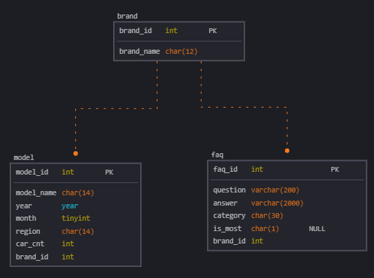
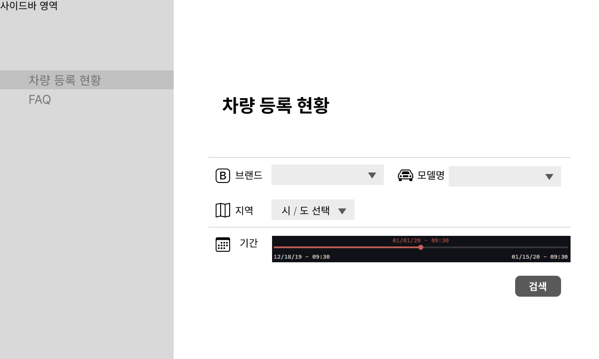
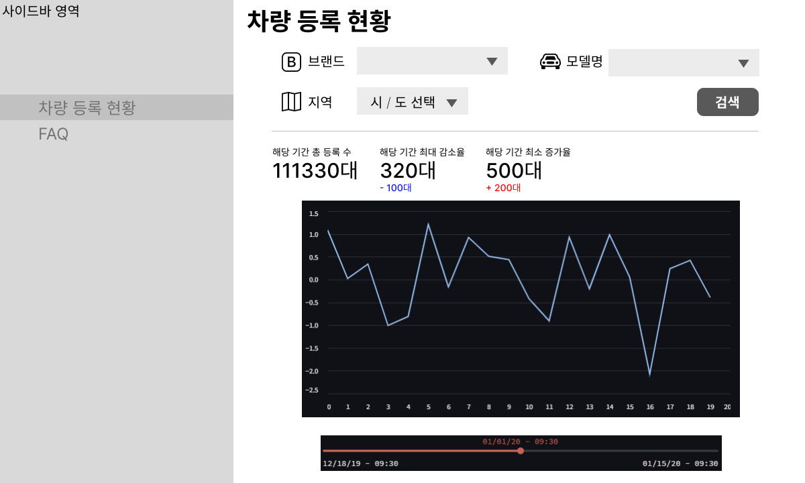
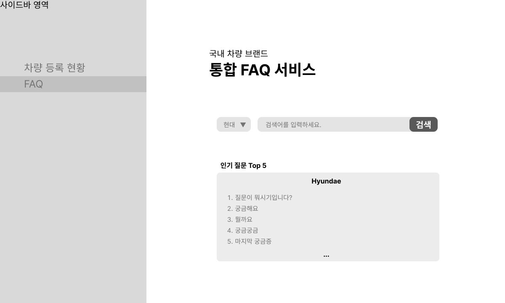
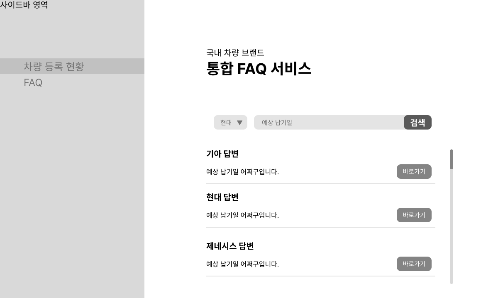

# 전국 자동차 등록 현황 및 기업 FAQ 조회 시스템

## 프로젝트 소개

이 프로젝트는 전국 자동차 등록 현황 데이터를 분석하고 이를 기반으로 FAQ 조회 시스템을 구축하여 사용자에게 유용한 정보를 제공하는 것을 목표로 합니다.

## 팀원 소개

Team. 아무코토모로게땅 
| 박중헌 (PM) | 오승민 | 송영빈 | 문희선 |
|:----------:|:----------:|:----------:|:----------:|
|역할|역할|역할|역할|
| [@qjrm1430](https://github.com/qjrm1430) | [@artemIntellectus](https://github.com/artemIntellectus) | [@GETSPRING8230](https://github.com/GETSPRING8230) | [@MoonHeesun](https://github.com/MoonHeesun) |

## 프로젝트 요구사항

### 전국 자동차 등록 현황 **조회**

- **자동차 등록 현황 조회:** 사용자가 특정 지역, 연도 또는 차량 종류에 따라 자동차 등록 현황 데이터를 검색하고 조회할 수 있는 기능.
- **브랜드별 분류:** 예: 현대, 기아, 제네시스, KG 모빌리티, 르노
- **모델별 분류:** 예: 기아의 경우 - 쏘렌토, 카니발, k8

### 기업 FAQ 조회

## 추가 기능

### 데이터 검색

- 
- 

### 데이터 시각화

- 
- 

## ER Diagram

## 스토리보드

- 차량 검색 화면

- 차량 검색 결과 화면

- FAQ 검색 화면

- FAQ 검색 결과 화면

## 실제 동작 화면

이미지 삽입 예정

## 컨벤션 규칙

### 포매터

- black formatter

### 네이밍 컨벤션

- 폴더이름, 클래스 : 카멜 케이스
- 파일이름, 함수이름, 변수이름 : 스네이크 케이스

### git commit 컨벤션

> 유형별로 구분하여 작성

- **feat** : 새로운 기능 추가
- **fix** : 버그 수정
- **docs** : 문서 수정
- **style** : (코드의 수정 없이) 스타일(style)만 변경(들여쓰기 같은 포맷이나 세미콜론을 빼먹은 경우)
- **refactor** : 코드 리펙토링
- **test** : Test 관련한 코드의 추가, 수정
- **chore** : (코드의 수정 없이) 설정 변경

## Git Branch 전략

github flow 전략 사용

main branch를 제외한 모든 branch는 feature branch로 생성하여 작업 후 pull request를 통해 main branch에 merge

1. 박중헌, 오승민, 송영빈, 문희선 각자 feature branch 생성
2. 각자의 feature branch에서 작업
3. 작업이 완료되면 main branch로 pull request 생성
4. 코드 리뷰 후 main branch에 merge

## 기술 스택

### 언어

### 라이브러리

badge로 삽입할 예정

### 데이터베이스

