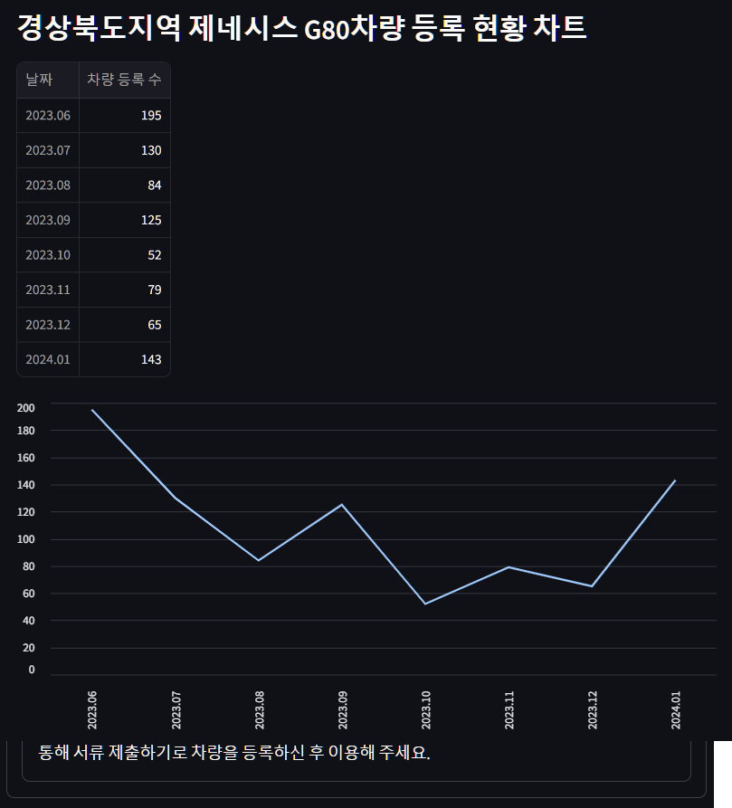

# 🚗전국 자동차 등록 현황 및 기업 FAQ 조회 시스템

## Ⅰ. 프로젝트 목표

> 개발기간: 2024.07.24 ~ 2024.07.25   
   
- 전국 자동차 등록 현황 데이터를 제공함으로써 사용자들이 차량 구매에 대하여 데이터 기반 의사결정을 할 수 있도록 지원
- 기업 통합 FAQ 조회 시스템을 구축하여 사용자에게 유용한 정보 제공

## 👥 팀원 소개
SK Networks AI CAMP 3기   
**Team. 아무코토모로게땅**
| 박중헌 (PM) | 오승민 | 송영빈 | 문희선 |
|:----------:|:----------:|:----------:|:----------:|
|DB 설계 Streamlit 화면 구성|자동차 등록 현황 crawling|Streamlit 화면 구성|FAQ crawling|
| [@qjrm1430](https://github.com/qjrm1430) | [@artemIntellectus](https://github.com/artemIntellectus) | [@GETSPRING8230](https://github.com/GETSPRING8230) | [@MoonHeesun](https://github.com/MoonHeesun) |

## Ⅱ. 프로젝트 요구사항

### 1. 전국 자동차 등록 현황 **조회🚗**

- 사용자가 차량 브랜드 및 모델에 따라 자동차 등록 현황 데이터를 검색하고 조회할 수 있는 기능.
- **브랜드별 분류**
  - 예) 현대, 기아, 제네시스, KG 모빌리티, 르노
 
- **모델별 분류**
  - 예) 기아의 경우 - 쏘렌토, 카니발, k8

### 2. 기업별 FAQ 조회💭

- 사용자가 자동차 관련 질문에 대해 검색하고 기업별 답변을 조회할 수 있는 기능.   

- **브랜드별 분류**
  - 기아, 제네시스

## 추가 기능

### 데이터 시각화

- 국내 차량 등록 현황 차트 
- 기아, 제네시스 FAQ 검색 결과 키워드 분석 텍스트

## Ⅲ. ER Diagram

## Ⅳ. 스토리보드

- 차량 검색 화면

- 차량 검색 결과 화면

- FAQ 검색 화면

- FAQ 검색 결과 화면

## 실제 동작 화면

- 차량 검색 화면

- 차량 검색 결과 화면

- FAQ 검색 화면

- FAQ 검색 결과 화면

## Ⅴ. 컨벤션 규칙

### 포매터

- black formatter

### 네이밍 컨벤션

- 폴더이름, 클래스 : Camel Case
- 파일이름, 함수이름, 변수이름 : Snake Case

### git commit 컨벤션

> 유형별로 구분하여 작성

- **feat** : 새로운 기능 추가
- **fix** : 버그 수정
- **docs** : 문서 수정
- **style** : (코드의 수정 없이) 스타일(style)만 변경(들여쓰기 같은 포맷이나 세미콜론을 빼먹은 경우)
- **refactor** : 코드 리펙토링
- **test** : Test 관련한 코드의 추가, 수정
- **chore** : (코드의 수정 없이) 설정 변경

## Git Branch 전략

github flow 전략 사용

main branch를 제외한 모든 branch는 feature branch로 생성하여 작업 후 pull request를 통해 main branch에 merge

1. 박중헌, 오승민, 송영빈, 문희선 각자 feature branch 생성
2. 각자의 feature branch에서 작업
3. 작업이 완료되면 main branch로 pull request 생성
4. 코드 리뷰 후 main branch에 merge

## 오류 해결 과정

- 특정 기간에 등록된 신규 차량이 없을 경우 위와 같은 팝업창이 뜸
  - 뒤로 가기를 눌러 해결하였고, 데이터 값은 0으로 처리
  
## 기술 스택

### 언어

### 라이브러리

 

### 데이터베이스

